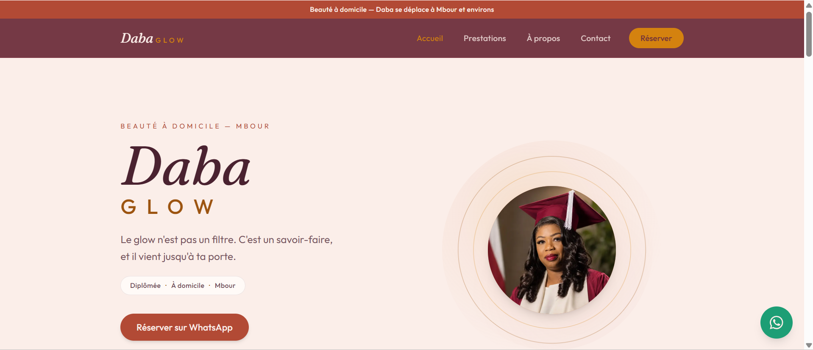
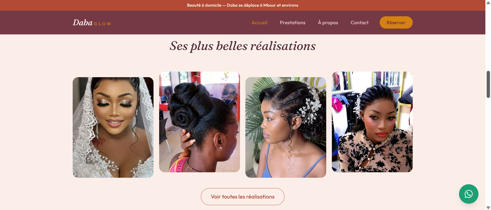
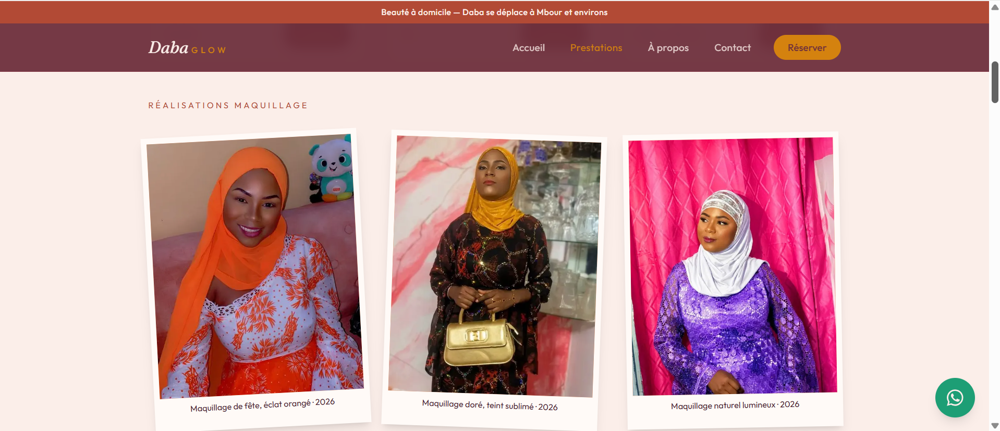
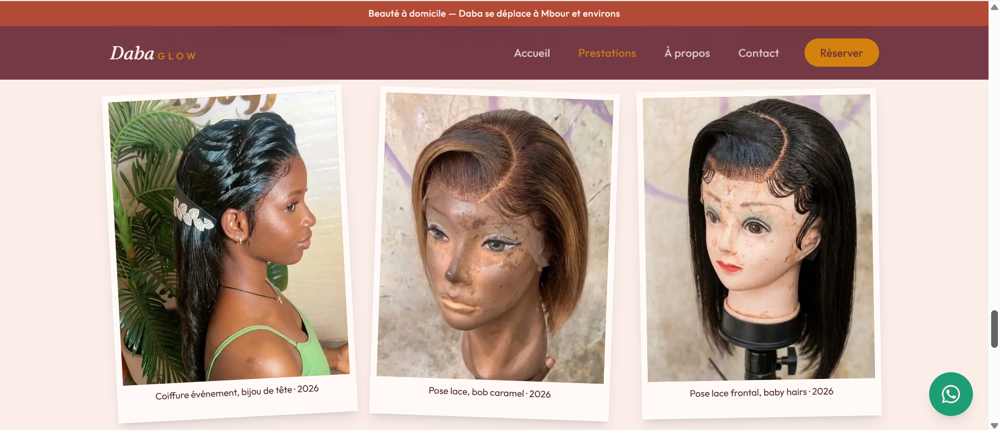

# ✨ Daba Glow — Site vitrine professionnel pour une activité de beauté à domicile

> Site web responsive conçu pour présenter les prestations de **Daba Glow**
> (maquillage, manucure, coiffure à domicile) à Mbour, valoriser son
> portfolio et faciliter la prise de contact via WhatsApp.
> Direction artistique éditoriale : chocolat profond, doré, typographie
> Fraunces italique.

Développé avec **Next.js 16, TypeScript et Tailwind CSS v4**.

Le projet a également été conçu comme un **template réutilisable pour les
commerces et activités locales** : le contenu métier est séparé du code
afin de permettre une adaptation rapide à un nouveau client.

> **🔗 Démo en ligne : [daba-glow.vercel.app](https://daba-glow.vercel.app/)**

## 🧱 Stack technique

| Technologie | Utilisation |
|---|---|
| Next.js 16 | Framework web et architecture de l'application |
| TypeScript | Typage statique et sécurité du code |
| Tailwind CSS v4 | Mise en forme et responsive design |
| Vitest | Tests unitaires et validation du contenu |
| GitHub Actions | Intégration continue |
| Vercel | Déploiement |
| WhatsApp | Canal de prise de contact |

## 🖼️ Aperçu

| Accueil | Réalisations coup de cœur |
| :---: | :---: |
|  |  |

Le portfolio par catégorie, en polaroïds — maquillage et coiffure :

| Réalisations maquillage | Réalisations coiffure |
| :---: | :---: |
|  |  |

## 🚀 Démarrer

```bash
npm install
npm run dev        # http://localhost:3000
```

Autres commandes :

```bash
npm test           # tests unitaires (Vitest)
npm run lint       # ESLint
npx tsc --noEmit   # vérification des types
npm run build      # build de production
```

## 🧠 Architecture : séparer le contenu du code

L'application sépare les données métier de la présentation. Les composants
et les pages consomment les fichiers du dossier `content/`, ce qui permet de
réutiliser la même base technique pour différents commerces sans modifier
la logique de l'application.

| Fichier                   | Contenu                                           |
| -------------------------- | -------------------------------------------------- |
| `content/site.config.ts`  | Nom, slogan, **numéro WhatsApp**, réseaux, zone   |
| `content/prestations.ts`  | Prestations, descriptions, prix, durées           |
| `content/realisations.ts` | Galerie : photos et vidéos TikTok                 |
| `content/atouts.ts`       | Chiffres clés et atouts                           |

## 🧩 Composants signature

- `Halo` — le portrait dans ses anneaux dorés pulsants (héro)
- `Marquee` — bandeau défilant des prestations
- `GalerieCategorie` — portfolio polaroïd d'une catégorie (photos + TikTok, lightbox clavier)
- `GalerieApercu` — sélection "coup de cœur" mise en avant sur l'accueil
- `TikTokEmbed` — vidéos TikTok en chargement différé (clic pour charger)
- `Reveal` — apparition douce au scroll (IntersectionObserver, zéro dépendance)

Accessibilité incluse : skip-link, focus visible, `prefers-reduced-motion`,
navigation clavier.

## ✅ Qualité & tests

- **TypeScript strict**, **ESLint** (config plate Next 16) et build : zéro erreur.
- **Tests unitaires (Vitest)** sur le helper de formatage et surtout sur
  **l'intégrité du contenu** : chaque prestation/réalisation a ses champs, des
  clés uniques, une catégorie valide, et **chaque image référencée existe bien
  dans `public/`**. Idéal pour un template : une faute de frappe dans un nom de
  fichier est attrapée par la CI, pas par la visiteuse.
- **Intégration continue** (GitHub Actions) : lint + types + tests + build à
  chaque push et pull request (`.github/workflows/ci.yml`).
- **Accessibilité** : skip-link, focus visible, navigation clavier (lightbox,
  menu), `prefers-reduced-motion`, attributs ARIA sur les dialogues.

## 🔁 Réutiliser comme template

Pour un nouveau commerce : dupliquer le projet, remplacer le dossier
`content/`, ajuster les couleurs dans `app/globals.css` (`@theme`) et les
polices dans `app/layout.tsx`. Le code ne change pas.

---

Conçu et développé par **Ndeye Penda Sarr 2026**.